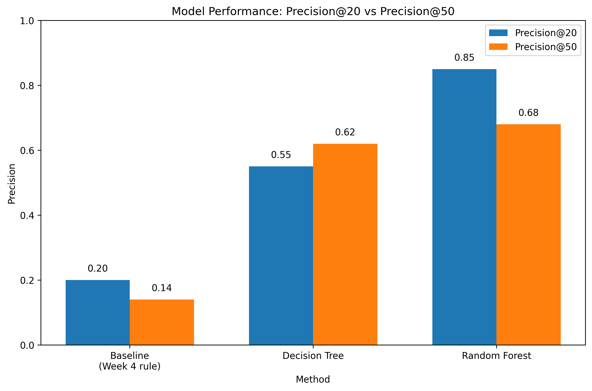

# Refresh / Content Opportunity Scoring: Identifying Pages That Need Review First

## Abstract

This study addresses the challenge of identifying which pages should be prioritized for content review or refresh. We developed a rule-based scoring approach using content-performance signals such as search impressions, clicks, CTR, and search position to identify pages with potential performance opportunities.

Initial analysis showed that page activity and search performance were associated with CTR and click volume. We then compared the rule-based approach with Decision Tree and Random Forest models to evaluate whether machine learning could improve page prioritization.

The Random Forest model achieved a **Precision@20 of 0.85 (85%)**, compared with **0.20 (20%) for the baseline rule-based score**. This means that 17 of the top 20 pages ranked by the Random Forest corresponded to the target priority class, compared with only 4 of the top 20 pages identified by the baseline.

These findings suggest that combining multiple content-performance signals through a learned model can improve the identification of pages that may benefit from content review or refresh. The results can support SEO teams in prioritizing a limited number of pages for further investigation.

# Introduction / Problem Statement

Websites accumulate hundreds or thousands of content pages over time, but not every page performs equally. Some pages maintain strong search visibility, while others show weak performance or signs that they may need attention. This work addresses one specific decision: **which page should an SEO manager review first**, given limited time and resources.

The output is intended to help prioritize pages for content refresh, title or metadata review, or closer monitoring. Reviewing a page that does not need attention wastes limited resources, while missing a genuinely underperforming page may result in lost search opportunities.

Several performance signals can indicate that a page may require review. For example, a page may receive a high number of impressions but have a poor ranking position and low CTR, meaning that search visibility is not translating effectively into clicks. Other pages may show limited activity or declining performance. However, relying on a single signal such as CTR, ranking position, or traffic decline does not provide a consistent way to determine which pages should be reviewed first.

To address this problem, this project combines multiple content-performance signals into a rule-based priority score. The score allows pages to be ranked systematically according to their potential opportunity rather than evaluated using a single signal at a time. The study then compares this rule-based approach with machine learning models to determine whether the prioritization can be improved.

**The objective of this study is to develop and evaluate a scoring approach that combines multiple content-performance signals to prioritize pages for content review or refresh.**

# Data

We initially used a small static CSV provided in the starter repository for exploratory analysis and development. We then moved to FlyRank's larger production data warehouse, hosted on Hugging Face and queried using DuckDB. The primary table used in this study was `fact_content_daily_performance`, which contains daily page-level performance data across multiple clients.

The initial data contract identified a broader set of potential features, including GA4 engagement signals such as `ga4_pageviews`, `ga4_sessions`, `ga4_engaged_sessions`, and `scroll_events`, as well as traffic-source information. However, availability checks showed that valid GA4 data was present for only **4.2% of rows**, compared with **36.7% for GSC data**. Because of this limited GA4 coverage, the final feature set used for modeling was built entirely from Google Search Console (GSC) signals.

The final modeling features were:

* `active_days`
* `total_impressions`
* `total_clicks`
* `avg_position`
* `ctr`

Real-world performance data contained missing values. Data-cleaning and preprocessing steps were therefore applied before analysis and modeling. Records that did not contain the information required for the relevant analysis were excluded so that the scoring and models were evaluated on usable records.

Because the dataset contains pages from multiple clients, a **client-grouped split** was used. All pages belonging to a given client were kept entirely within either the training/development data or the test data. This reduces the risk of client-specific data leakage and helps ensure that the models learn generalizable content-performance patterns rather than simply memorizing client-specific behavior.

# Methodology

The methodology was developed in two stages. First, potential content-performance signals were analyzed using the available development data. Second, the validated signals were used to develop a rule-based prioritization score and compare it with machine learning models.

## 5.1 Signal 1: Activity

We first tested whether page activity was associated with search performance. For each page, we counted the number of distinct days on which GSC data was available during the analysis period and grouped pages into three activity buckets:

* **Low activity:** 10 days or fewer
* **Medium activity:** 11–20 days
* **High activity:** more than 20 days

The results showed a clear relationship between activity and search performance. High-activity pages had an average of **2,637.4 impressions and 7.6 clicks**, compared with **283.7 impressions and 1.2 clicks** for medium-activity pages. Low-activity pages had only **26.9 average impressions and 0.1 average clicks**.

These results supported the use of activity as a screening signal for identifying pages that may require further review. However, low activity should not be interpreted as direct proof that content is stale, since limited activity may also result from insufficient search exposure or limited data availability.

## 5.2 Signal 2: Position and CTR

We then tested the relationship between search position and CTR. Pages were grouped into three position buckets:

* **Top 10**
* **Positions 11–20**
* **Position 20+**

Only records with GSC data available and at least 10 impressions were included in this analysis.

The results showed that higher-ranking pages generally had higher CTR. Pages in the top 10 had an average CTR of **0.0034**, compared with **0.0026** for positions 11–20 and **0.0013** for positions beyond 20.

This relationship provided evidence that search position is associated with CTR and supported the use of both position and click opportunity when prioritizing pages for review.

## 5.3 Rule-Based Priority Scoring

After validating the performance signals, we developed a rule-based scoring approach to prioritize pages for review.

The scoring focused on the opportunity created when a page receives search impressions but generates fewer clicks than expected.

Expected clicks were calculated as:

**Expected Clicks = Total Impressions × Expected CTR**

The difference between expected and observed clicks was then calculated:

**Opportunity Gap = Expected Clicks − Total Clicks**

The final priority score was calculated as:

**Priority Score = Opportunity Gap × 100**

A higher positive score represents a larger estimated gap between expected and actual clicks and therefore a greater potential opportunity for review.

Pages were ranked from highest to lowest priority score. This rule-based score served as the baseline against which the machine learning models were evaluated.

## 5.4 Machine Learning Comparison

The rule-based scoring system was used as the baseline approach. We then trained two machine learning models:

1. **Decision Tree**
2. **Random Forest**

The models used the available page-level performance features to learn patterns associated with the target priority class.

A client-grouped split was used so that pages belonging to the same client remained entirely within either the training/development data or the test data. This reduced the risk of client-specific data leakage.

The purpose of the machine learning comparison was to determine whether learned combinations of multiple signals could identify high-priority pages more effectively than the fixed rule-based score.

## 5.5 Evaluation

The baseline and machine learning approaches were compared using **Precision@20** and **Precision@50**.

Precision@K measures the proportion of the top K ranked pages that belong to the target priority class. This metric was selected because the practical goal is to help an SEO team identify a relatively small number of pages to review first.

# Results (vs Baseline)

| Method                      | Precision@20 | Precision@50 |
| --------------------------- | -----------: | -----------: |
| Baseline (Rule-Based Score) |         0.20 |         0.14 |
| Decision Tree               |         0.55 |         0.62 |
| Random Forest               |     **0.85** |     **0.68** |

The Random Forest model clearly outperformed the rule-based baseline across both evaluation metrics.

At **Precision@20**, Random Forest achieved **0.85**, meaning that **17 of the top 20 ranked pages** corresponded to the target priority class. The baseline achieved 0.20, corresponding to **4 of the top 20 pages**. Therefore, Random Forest achieved **4.25 times the baseline Precision@20**.

At **Precision@50**, Random Forest achieved **0.68**, compared with **0.14 for the baseline**. Although precision decreased when the ranking list was expanded from 20 to 50 pages, Random Forest continued to substantially outperform the baseline.

The Decision Tree also performed considerably better than the rule-based baseline. At Precision@20, it achieved 0.55 compared with 0.20 for the baseline. This suggests that even a relatively simple learned model can capture combinations of content-performance signals that a fixed scoring rule may miss.

Overall, the results indicate that the machine learning approaches, particularly Random Forest, were more effective at prioritizing pages belonging to the target class within a limited review capacity.

# Limitations

* The analysis was conducted using a specific FlyRank warehouse release and analysis period. Therefore, the results may not generalize to other time periods, datasets, or platforms.

* The labels used to define declining or priority pages were constructed as a proxy from available performance trends rather than manually verified ground-truth labels. Therefore, model performance should be interpreted in relation to the proxy definition.

* Some pages with very low activity and very few impressions produced unreliable signals. At Precision@20, three of the Random Forest predictions were incorrect, illustrating that the model can still be affected by low-sample-size noise.

* To reduce this issue in the final recommendations, pages with fewer than 10 impressions were excluded from the ranked recommendation list and treated as monitoring candidates rather than immediate review targets.

* Some additional fields were available in the warehouse, including engagement-related and AI-referral signals, but they were not deeply explored because their coverage was limited or sparse at the scale of this analysis.

* Real client and page identities are hashed and unrecoverable, so external validation of individual page recommendations was not possible.

* This work identifies **association, not causation**. The models do not establish why a page is underperforming and do not predict or explain Google's ranking algorithm.

* The results should be treated as **decision-support signals for editorial review**, rather than as a guaranteed or final verdict on any individual page.

# Ranked Recommendations

Using the Random Forest model's predicted probability scores, we removed pages with very low impression counts to reduce small-sample noise. The remaining pages were ranked according to their model scores to identify strong candidates for review.

## Priority 1 — Immediate Review (Top 5 Shown)

| Rank | Content ID       | Model Score | Impressions | Clicks | Avg Position |    CTR |
| ---: | ---------------- | ----------: | ----------: | -----: | -----------: | -----: |
|    1 | content_0aaa1970 |       0.697 |      37,613 |     22 |         36.3 | 0.058% |
|    2 | content_bfd481a7 |       0.695 |      10,404 |      9 |         42.4 | 0.087% |
|    3 | content_0c4bfb89 |       0.694 |      12,902 |      7 |         36.1 | 0.054% |
|    4 | content_91487e6f |       0.679 |      13,542 |     11 |         37.8 | 0.081% |
|    5 | content_7a0a59b4 |       0.678 |      37,775 |     22 |         34.0 | 0.058% |

These pages show a consistent pattern: they receive substantial search impressions but have weak average search positions and very low CTRs. Their average positions are all well outside the top 10 results, indicating that their search visibility is not translating effectively into clicks.

Because these pages have meaningful impression volumes, their signals are more reliable than those of pages with extremely small amounts of data. They should therefore be considered strong candidates for content review. Potential follow-up actions may include reviewing content relevance, updating outdated information, improving search-intent alignment, or evaluating titles and metadata.

## Priority 2 — Review Soon (Ranks 11–20)

The remaining pages in the top 20 have model scores of approximately **0.61–0.64**. They show a similar pattern of meaningful impression volume combined with relatively weak search positions and low CTR.

These pages should be reviewed after the Priority 1 candidates, as they may also represent opportunities for improving organic search performance.

## Priority 3 — Monitor

Pages with fewer than 10 impressions were excluded from the immediate ranked recommendations because their model scores may be unreliable due to small-sample noise.

Rather than making immediate content changes, these pages should be monitored as more impressions and clicks accumulate. Once sufficient data becomes available, they can be evaluated again using the scoring and modeling approach.

## Note

All content and client identifiers are anonymized hashes generated by FlyRank. No real page URLs, client names, or private information are disclosed.

# Reproducibility

* **Dataset:** FlyRank ML Internship Warehouse, specifically the `fact_content_daily_performance` table, accessed through the FlyRank internship dataset hosted on Hugging Face.

* **Dataset Source:** [FlyRank Internship Warehouse — Hugging Face](https://huggingface.co/datasets/FlyRank/internship-warehouse)

* **Code/Repository:** [Machine_learning_internship — GitHub](https://github.com/Laiba-Tahir29/Machine_learning_internship) — the assignment notebooks and final capstone notebook are available in `work/notebooks/`.

* **Assignment Workflow:** The internship initially required five assignments. The remaining assignments were completed later as additional time became available. After completing the assignment work, the final **capstone project** was developed using the same dataset and repository.

* **Software/Libraries:** Python, DuckDB, pandas, NumPy, and scikit-learn. DuckDB was used for querying and aggregating the warehouse data, while scikit-learn was used to train and evaluate the Decision Tree and Random Forest models.

* **Features Used:** `active_days`, `total_impressions`, `total_clicks`, `avg_position`, and `ctr`.

* **Target/Label:** `is_declining` — a binary target derived from `trend_direction` by comparing an earlier and later period within the development data.

* **Baseline Scoring Formula:**

  * Expected Clicks = Total Impressions × Expected CTR
  * Opportunity Gap = Expected Clicks − Total Clicks
  * Priority Score = Opportunity Gap × 100

* **Split Design:** A client-grouped train/test split was used so that pages belonging to the same client remained entirely within either the training/development data or the test data. This helped prevent client-specific data leakage.

* **Evaluation Metric:** Precision@K, with K = 20 and K = 50, was used to measure how effectively the models identified high-priority pages within a limited review capacity.

* **Processing Workflow:** The assignment notebooks were completed as part of the internship workflow. The final `capstone.ipynb` was then run for the end-to-end analysis, including baseline scoring, Decision Tree and Random Forest training, evaluation, model comparison, and generation of the ranked recommendations.

* **Result Generation:** The results and tables presented in this report were generated from notebook outputs using the dataset and methodology described above. No values in the final results were manually changed after generation.

# Acknowledgments

This project was developed using the FlyRank ML Internship dataset.

Thanks to the FlyRank team, Mirza, and Alen for providing the internship resources, guidance, and support throughout the project.

[FlyRank](https://flyrank.ai?utm_source=chatgpt.com)
